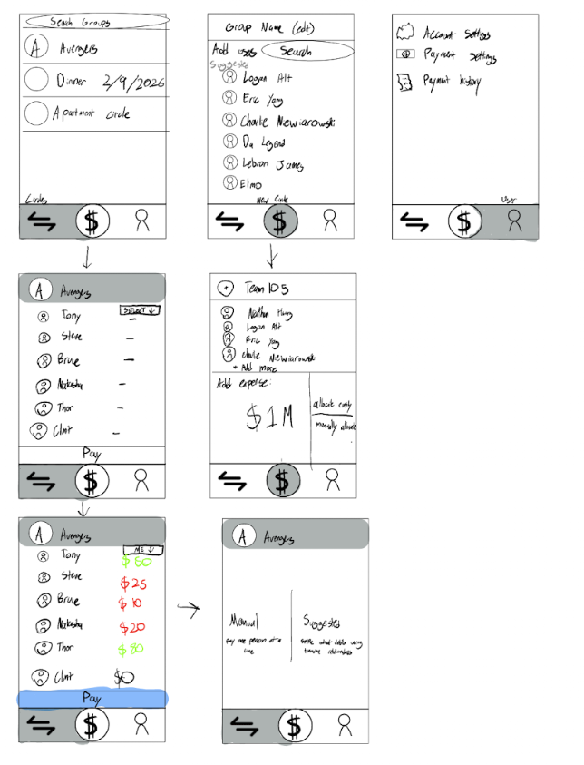

# Project Proposal

## Project Summary 
Our web app is a shared expense and debt management system designed to help friends efficiently track, split, and settle money owed within social circles. Our users will be able to record transactions that allow them to view real-time net balances between members, reducing confusion about who owes what. This system will model debts relationally, representing the relationships between users as structured connections that reflect outstanding debts. By organizing debt and transaction data within social circles clearly and consistently, our app will provide users with the confidence to front expenses for their friends without hesitation.  

## Creative Component 
We will also compute simplified settlement suggestions to minimize the number of payments required to balance a group. That is, if person A owes person B $20, and person B owes person C $10, person B may opt to relieve his debts with the debt held by person A. On top of this we will also implement a reliability scoring system to enhance our user's experience. This score will be on a scale from 0-100, where users start off at a baseline score of 70 and will move up and down based on our algorithm. This algorithm will require testing along with trial and error to optimize but will be complex enough to consider, late payments, early payments, money lent, and amount of money involved in those interactions. We will also use this system to predict a payback date, setting our app apart from others in terms of reliability.   

## Usefulness 
Our app is useful in its ability to allow users to organize and clearly display the money owed within their social circles. With both parties needing to approve a debt, users will be able to show these debts concretely and have a higher probability of being repaid. This will provide the confidence necessary for users to loan money to their peers. This app has already been implemented (Tricount), but it does not hold the same features that we will offer. 

## Realness 
As discussed in Abdu’s office hours, we will be using generative AI for our datasets. We will prompt for intra-circle debt data that will consist of, user IDs and names, amount owed/paid, loan date/paid date. 

## Functionality 
Our website will allow users to create and participate in shared circles where expenses and debts are tracked in an organized and transparent manner. Within a circle, users can record expenses by specifying who paid, the total amount, and which members were involved. When an expense is submitted, the system will automatically generate debts between users based on how a cost is split. These debts will only become active once both parties give approval, ensuring agreement, and mitigate disputes. Users will be able to read/view expenses and net balances within a circle for full transparency of who owes money and is owed money. Users will also be able to update records by modifying submitted expenses when needed and delete entries that were added incorrectly, keeping the group ledger accurate. Users will be able to search for groups, other users, and expenses to find specific friends and transactions. A key feature of our application will be its ability to compute settlement suggestions that minimize the number of transaction steps needed to get money where it ultimately needs to do. As described in our creative component, the app will recommend efficient ways to resolve sequences of debt related transactions and “fill in the gaps” to make the exchange of money easier and intuitive. Overall, users will be able to add, review, approve, and settle shared expenses in a collaborative and structured environment that promotes transparency and accountability within social circles.  

## UI mockup: 

 
## Project Distribution: 
Nathan Hwang - UI/UX Design, Data collection, Back end – database, presentation 
Logan Alt - Data testing, Front end - Data visualization, Back end – database, presentation 
Charlie Niewiarowski - Front End - UI implement, back end – algorithm, presentation 
Eric Yang - Data collection, Data testing, back end - algorithm, presentatation 

 

 

 

 

 

 

 

 

 

Project Distribution: 

Nathan Hwang - UI/UX Design, Data collection, Back end – database, presentation 

Logan Alt - Data testing, Front end - Data visualization, Back end – database, presentation 

Charlie Niewiarowski - Front End - UI implement, back end – algorithm, presentation 

Eric Yang - Data collection, Data testing, back end - algorithm, presentataion 